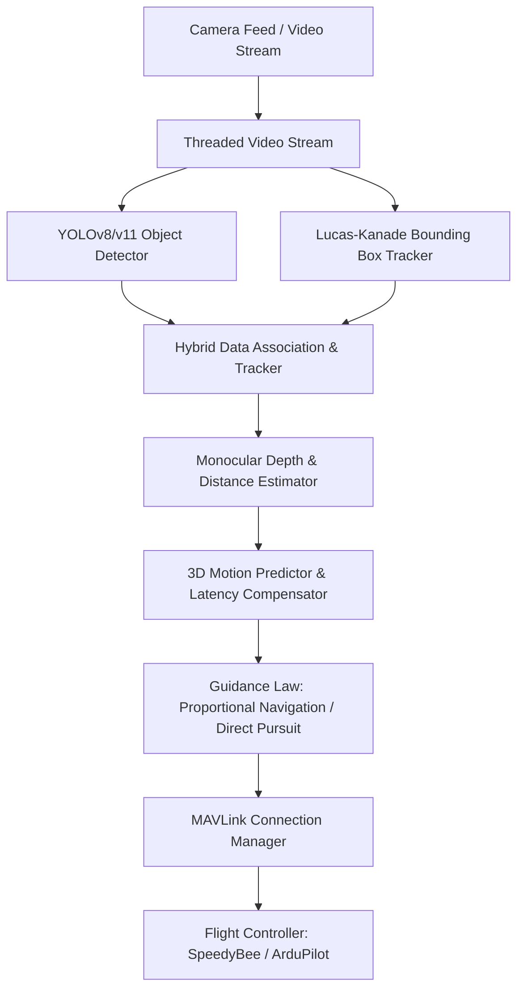

# Real-Time Autonomous Drone Pursuit & Anti-Drone Tracking System

[](https://github.com/ultralytics/ultralytics)
[](https://ardupilot.org/)
[](https://mavlink.io/en/)

This repository implements a fully functional, real-time autonomous target drone detection, tracking, and pursuit guidance system. The pipeline integrates high-performance object detection, hybrid visual tracking, monocular range estimation, 3D trajectory prediction, and flight control guidance laws. It communicates via MAVLink directly with flight controllers (such as the SpeedyBee F405/F7 running ArduPilot).

The system includes a dedicated workspace for cleaning, offline augmenting, and enhancing custom drone datasets to optimize YOLO models for detecting small, distant targets.

---

## 🛠️ System Architecture

The following diagram illustrates the anti-drone pipeline from camera feed capture to guidance command transmission:



---

## 📂 Project Structure

```text
Bytetrack/
 ├── anti_drone_system/             # Core autonomous pursuit pipeline
 │    ├── configs/                  # Settings and parameters configuration files
 │    │    ├── settings.yaml        # Main settings (YOLO, tracker, ranging, guidance, MAVLink)
 │    │    └── data.yaml            # YOLO dataset file reference
 │    ├── control/                  # Flight control & guidance laws
 │    │    ├── pn_guidance.py       # Proportional Navigation (PN) guidance controller
 │    │    └── pursuit.py           # Direct rules-based target pursuit controller
 │    ├── detector/                 # Vision detection module
 │    │    └── yolo_detector.py     # YOLOv8 target detector wrapper
 │    ├── mavlink/                  # Telemetry and guidance protocol manager
 │    │    └── connection.py        # MAVLink serial/UDP/TCP interface connection manager
 │    ├── prediction/               # Trajectory forecasting and latency compensation
 │    │    └── motion_predictor.py  # 3D Kalman filter motion state predictor
 │    ├── ranging/                  # Real-time depth estimator
 │    │    └── distance_estimator.py# Monocular size-to-distance calculator
 │    ├── simulation/               # Software-in-the-loop (SITL) simulators
 │    │    └── sitl_sim.py          # Virtual moving target coordinate generator
 │    ├── utils/                    # Common helper utilities
 │    │    ├── dataset_manager.py   # Dataset validation and structure parser
 │    │    ├── video_stream.py      # Threaded high-frequency frame capture
 │    │    └── visualization.py     # HUD graphics overlay and target boxes renderers
 │    ├── main.py                   # Main pipeline entrypoint (runs simulations and deployments)
 │    ├── train.py                  # Script: Trains the YOLO model on custom datasets
 │    └── test_detector.py          # Script: Offline video or camera verification testing
 ├── coco json drone detection/     # Dataset workspace (augmentations and enhancements)
 │    ├── dataset/                  # Custom dataset directory (train/valid/test splits)
 │    ├── dataset_merged/           # Roboflow + Custom auto-annotated merged dataset
 │    ├── All drones/               # Raw unannotated categories folders (fixed wing, quad, etc.)
 │    ├── Birds/                    # Negative targets (birds images for False Positive reduction)
 │    ├── augment_dataset.py        # Custom offline image augmentations script
 │    ├── enhance_dataset.py        # CLAHE local contrast & SAHI overlapping tiling enhancer
 │    ├── auto_annotate.py          # Pseudo-label generation for unannotated categories
 │    ├── train_model.py            # Custom training presets script
 │    └── evaluate.py               # Evaluation splits validation tool
 └── README.md                      # This main project documentation
```

---

## ✨ Core Features

*   **Hybrid Tracking Core**: Utilizes `ByteTrack` combined with a `Lucas-Kanade` (LK) bounding box optical flow tracker to keep lock during high-speed maneuvers or YOLO detection drops, maintaining ID consistency.
*   **3D Motion Predictor**: Runs a 3D Kalman filter tracking state estimation to calculate target velocity vectors and project target coordinates 5 steps ahead, compensating for processing and telemetry communication delays.
*   **Advanced Guidance Controllers**: 
    *   *Proportional Navigation (PN)*: Intercept guidance law that commands acceleration proportional to the line-of-sight angular rate.
    *   *Direct Pursuit*: Straight line target-following rule control.
*   **Monocular Depth Ranging**: Estimates absolute distance to target drone based on camera focal properties and the estimated physical target size.
*   **Telemetry Connection Interface**: Implements robust UDP, TCP, and Serial connections via `pymavlink` supporting takeoff, arm, land, RTL, guided flight commands, and failsafe modes.
*   **Virtual Target Simulator**: Integrates a virtual SITL simulator projecting a 3D flying target coordinates onto the 2D frame for offline control validation.
*   **Dataset Enhancement Workspace**: Custom tiling and local contrast enhancement strategies optimize YOLO performance on small, distant targets.

---

## ⚡ Setup & Installation

### Prerequisites
*   Python 3.8 to 3.11 (Python 3.10 recommended)
*   CUDA-compatible GPU (highly recommended for real-time edge processing)

### Installation Steps

1.  **Clone the Repository** and navigate to the project directory:
    ```bash
    git clone https://github.com/Ankursh121/ByteTracker-PN-control-Custom_Datasets.git
    cd ByteTracker-PN-control-Custom_Datasets
    ```

2.  **Create and Activate a Virtual Environment**:
    ```bash
    # Windows
    python -m venv .venv
    .venv\Scripts\activate

    # Linux/macOS
    python3 -m venv .venv
    source .venv/bin/activate
    ```

3.  **Install Required Dependencies**:
    ```bash
    pip install -r anti_drone_system/requirements.txt
    ```

---

## ⚙️ Configuration & Settings

System settings are centralized in [settings.yaml](file:///d:/Bytetrack/anti_drone_system/configs/settings.yaml). Key parameters include:

*   **`yolo`**: Defines the model path (`models/best.pt`), confidence thresholds, and image dimensions.
*   **`tracker`**: Configures fallback parameters, buffer, and LK tracker parameters.
*   **`ranging`**: Calibrates camera properties (`focal_length` in px) and target physical dimensions (`drone_real_size` in meters).
*   **`guidance`**: Sets proportional navigation gain (`nav_constant`), max velocities (safety limits for `max_speed_xy` / `max_speed_z`), and target lock angular deadzones.
*   **`mavlink`**: Sets connection properties. Switch `connection_type` to `serial` and `serial_port` to your respective port (e.g., `COM3` on Windows, `/dev/ttyACM0` on Linux) to plug directly into a SpeedyBee Flight Controller.
*   **`camera`**: Configures source indexes (webcam, RTSP stream, or video file path) and frame buffer sizes.

---

## 🚀 How to Run the Pipeline

The system is now driven by a fast, asynchronous FastAPI backend and a beautiful React dashboard for real-time telemetry and control.

### 1. Start the Backend Server
Run the FastAPI backend which manages the tracking pipeline, YOLO inference, and MAVLink connection:
```bash
# From the root ByteTracker-PN-control-Custom_Datasets directory
python anti_drone_system/web_server.py
```
*Note: The backend automatically reads from your `settings.yaml` configuration to determine the operating mode (simulation, webcam, or hardware) and camera sources.*

### 2. Start the React Dashboard
In a new terminal window, start the interactive web UI:
```bash
cd ui
npm install
npm run dev
```
Navigate to `http://localhost:5173` in your web browser to access the ORCUS Dashboard.

---

## 🎮 React Interactive Dashboard

The system features a complete **React-based Web UI** replacing the old OpenCV debug window. The dashboard provides full control over the autonomous drone, real-time hardware telemetry, and dynamic configuration.

### Dashboard Features:
*   **Live Telemetry & Identity**: Displays real-time flight telemetry (battery voltage, altitude, speed) and extracts unique device metadata (System ID, Autopilot type) directly from MAVLink heartbeats.
*   **Dynamic Camera Selection**: Seamlessly enumerate and select external video capture devices (e.g., Analog UVC video receivers for wireless FPV feeds) on the fly via the browser's `MediaDevices` API.
*   **One-Click Engagement**: 
    *   🔵 **[ FOLLOW ]**: Engages Hybrid Follow logic. Dynamically uses Direct Pursuit to aggressively close the gap, then smoothly transitions to station-keeping at your desired standoff distance.
    *   🔴 **[ DESTROY ]**: Immediately locks in Proportional Navigation (PN) logic to calculate an intercept trajectory for a direct collision course.
*   **Flight Controls**: Dedicated solid-state buttons for ARM, DISARM, TAKEOFF, and an **EMERGENCY STOP** that instantly halts autonomous guidance.
*   **Wireless Field Deployment**: Configured to support remote operation over wireless telemetry links (radio modules at 57600 baud) for true field deployment alongside analog UVC video receivers.

---

## 🏋️ Model Training & Dataset Workspace

The repository provides a complete pipeline to prepare, clean, augment, and train custom YOLO models.

### Step 1: Preprocess, structure, and clean the datasets
Converts roboflow dataset schemas, resizes images, and formats them:
```bash
python "coco json drone detection/restructure_custom_dataset.py"
```

### Step 2: Apply Enhancements (Recommended)
Performs CLAHE contrast normalization and SAHI-style overlapping slicing to optimize detection of small, distant targets:
```bash
python "coco json drone detection/enhance_dataset.py"
```

### Step 3: Run Training
Start training a YOLOv8s model with hardware-aware optimization presets (automatically detects VRAM and configures batch size / workers):
```bash
python anti_drone_system/train.py
```
After training, the best model weights will automatically be saved to `anti_drone_system/models/best.pt` and exported to an optimized `.onnx` model format.

---

## 🛡️ Failsafe and Safety Operations

The system includes multiple integrated safety features for autonomous operations:
1.  **Guidance Safety Switch**: Autonomous flight commands are disabled by default. You must arm and toggle guidance on manually (`t` key) to authorize autonomous pursuit.
2.  **Telemetry Heartbeat Timeout**: If the companion computer fails to communicate telemetry updates to the flight controller for more than 2 seconds, the FC triggers a safety hover.
3.  **Target-Loss Failsafe**: If the target drone is lost by both YOLO and the optical flow tracker, the system automatically commands a zero-velocity hover instead of flying on stale data.
4.  **Emergency Stop Key**: Hitting `e` in the feed window instantly disables autonomous navigation and puts the drone into a hover state.
